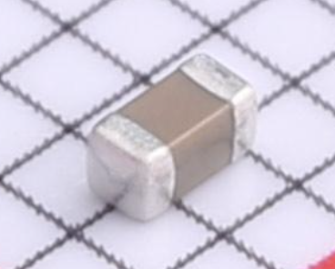
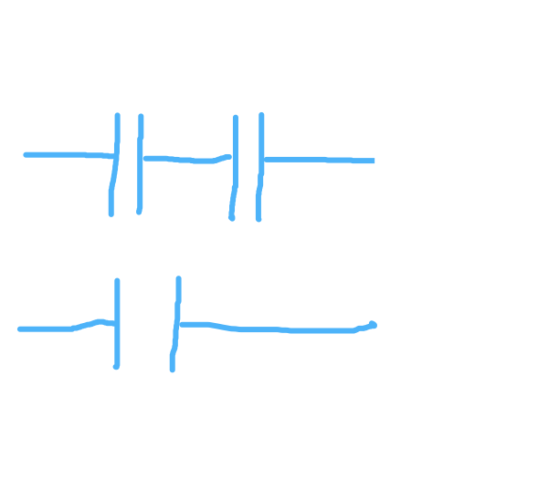
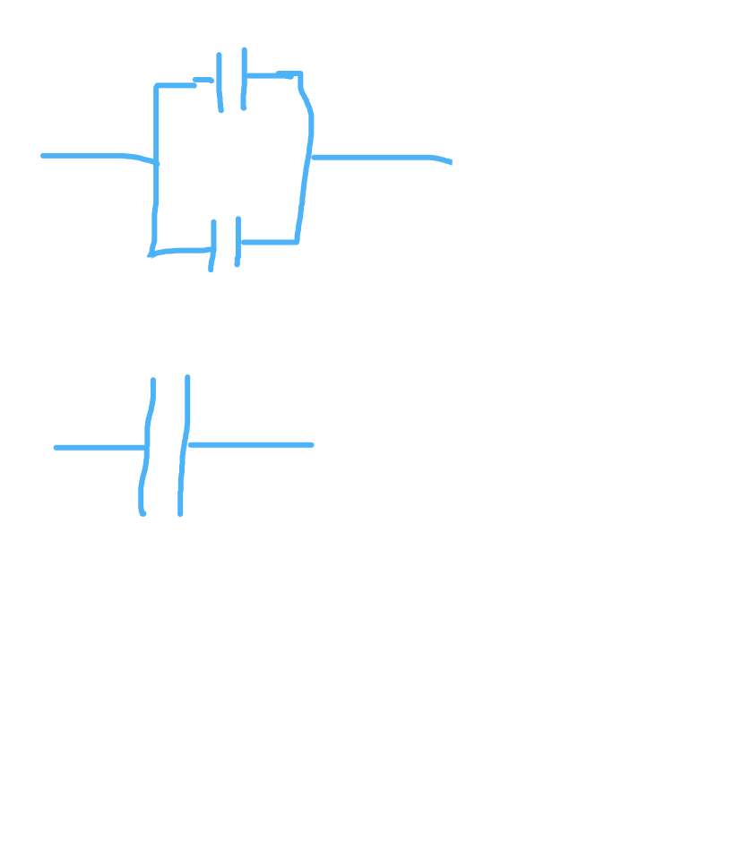
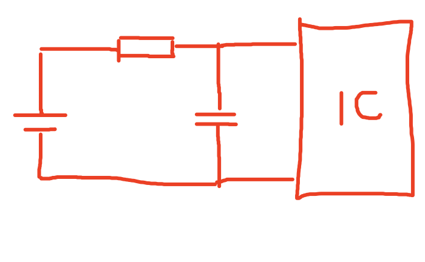
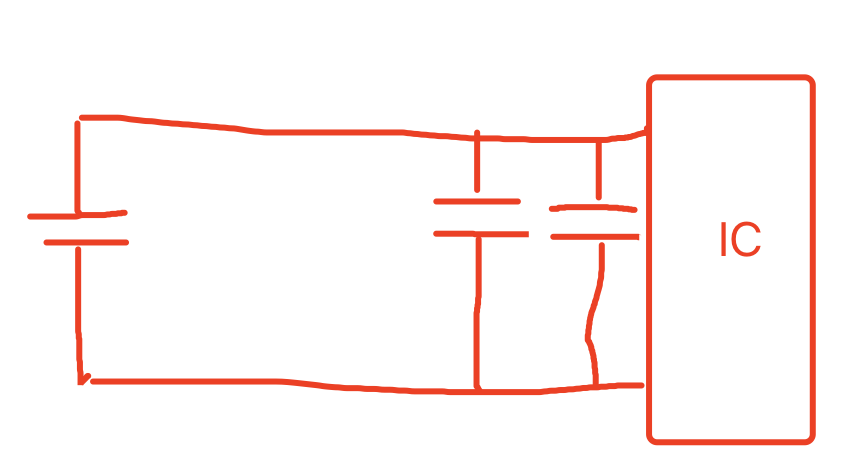
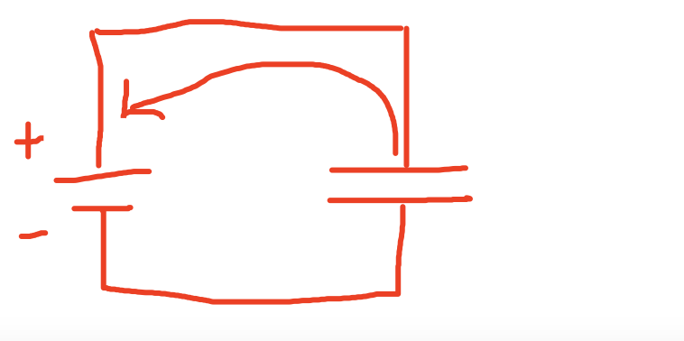
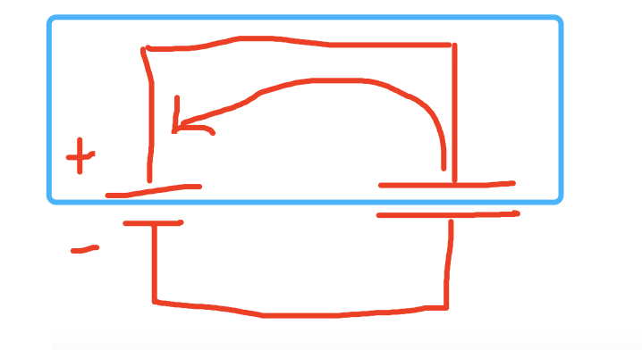
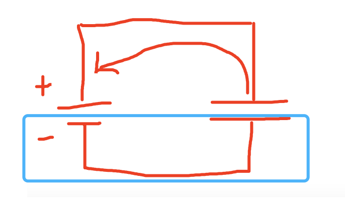
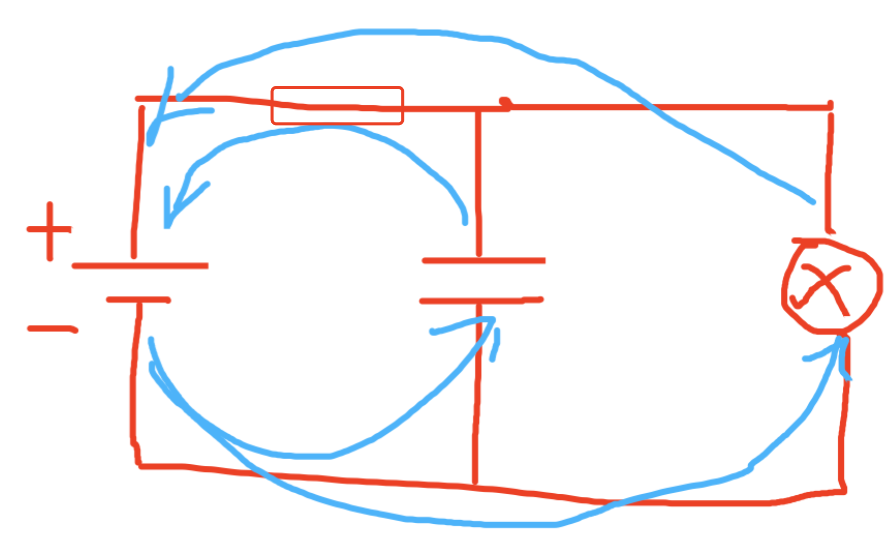

# 电容

## 介绍篇

> 电容器（英文：capacitor，又称为condenser）是将电能储存在电场中的被动电子器件。电容器的储能特性可以用电容表示。在电路中邻近的导体之间即存在电容，而电容器是为了增加电路中的电容量而加入的电子器件。
>
> 电容器的外型以及其构造依其种类而不同，目前常使用的电容器也有许多不同种类。大部分的电容至少会有二个金属板或是金属表面的导体，中间有介电质隔开。导体可以是金属箔、薄膜、烧结金属珠或是电解质。无导电性的介电质可以增加电容器的储电能力。常见的介电质有玻璃、陶瓷器、塑胶膜、纸、云母及氧化物。在许多的电路中都会用到电容器。电容器和电阻器不同，理想的电容器不会消耗能量。
>
> 当两个介电质隔开的导体之间有电压时，在介电质上会产生电场，因此正电荷会集中在一个导体，负电荷则是在另一个导体。电容器的电容定义为累积电荷和导体电压之间的比值。国际单位制（SI）下电容的单位是法拉（F），定义为每伏特1库仑（1 C/V）。一般电容器的电容约在1 皮法拉（pF）（10−12 F）到1 毫法拉（mF）（10−3 F）。电容器的电容和导体的表面积成正比，和导体之间距离比反比。实务上，导体之间的介电质会通过微小的漏电流。而介电质的电场强度也有上限，因此电容器会有击穿电压。而电容器中的导体及其引脚会产生不想要的等效串联电感及等效串联电阻。
>
> 电容器常用在电子电路中，阻隔直流电，让交流电可以流过电容器。在模拟滤波电路中，电容器可以使电源供应的输出变平滑。在LC电路中电容器和电感器可以调谐无线电到特定的频率。在输电系统中可以稳定电压及功率的流动[1]。在早期的数字电脑中，会用电容器储存能量的特性作为动态内存[2]。

在电子产品中，我们一般所说的电容实际上就是指的电容器。

-20210721163717789.jpg)

上图就是电容的样子，不过现在一般用的贴片电容，比较小，一般只有几毫米大小，长下面这个样子

## 知识篇

1. 电容器的结构大体上是两个金属片（导体），中间夹了点介电质（可被电极化的绝缘体，比如纸）。两边的金属片子面积越大，能储存的电能越多，中间夹的纸片子厚度越小，能储存的电能越多，即电容越大，反之能储存的电能越少，即电容越小。

2. 电容器在串联的时候隔直通交，也就是说，如果是说，如果电源是直流电，那么串联在电容器之后元器件就不工作，电流被电容器给隔绝了，流不过去。

3. 电容器串联之后，电容会变小。多个电容器串联起来相当于两边的金属片子没变，但是中间的纸片子变厚了，所以电容变小了。

   （如下图，竖线代表电容两边的金属片子，两条竖线直接的距离代表纸片子的厚度。下图的上部分等价于下部分）

   

4. 电容器并联之后，电容会变大。多个电容器并联起来相当于中间的纸片子没变厚，但是两边的金属片子面积变大了，所以电容变了。

   （如下图，上下两部分等价）

   

   

   

## 应用篇

* RC延时电路

  （图3-1）

+ 滤波电路

  （图3-2）

- 曝光

（图3-1）

（图3-2）

## 理解篇

### 前置知识

- 电荷——物质的一种物理性质，称带有电荷的物质为“带电物质”。从某种意义上说，“电”就是“电荷”的简称。我们说一个东西有没有电，就是说这个东西带不带电荷。
- 电子——带电粒子的一种。
- 异性相吸、同性相斥。

+ 电子的运动方向与电流方向相反。这个就比较奇怪了，特别不符合常识。我们经常用水流来比喻电流，但是水流正常，水往东流，我们就说水流的方向是东，水往西流，我们就说水流的方向是西。但怎么到了电流这就反了呢？电往东流，为什么要说电流的方向是西？其实这是历史原因。物理上规定正电荷定向运动的方向是电流的方向，下这个规定的时候，还比较早，那个时候对电子研究的还不是很透彻。但是后来发现，导线中可以自由移动的电子是带负电（荷）的，也就是说可以移动的是负电子。那么很显然了，既然移动的是负电子，理应规定负电子的移动方向为电流方向才对。但是呢，可能物理学家比较懒，不想改吧。开个玩笑啦！其实不改主要有两个愿意：一是由于基于之前的规定已经推出来很多公式了，写了很多书了，教育了很多年了，改起来成本太大了。二是确实也是存在正电子移动负电子不移动（不常见），正负电子都移动的情况，所以无论咋规定都不能让正负电子都满意。
+ 正常情况下金属板呈现电中性，当很多的外部负电子进入其中，它就呈现负电，当内部很多的负电子流失后，它就呈现正电。

有了上述前置知识，我们可以规定一下，接下来不讨论电流方向，只讨论（负）电子移动方向。

### 电子间的爱恨情仇？

上图。左边是一个电源，比喻成城市，右边是个电容，比喻成农村。电池的上方是正极，比喻成男人，电池下方是负极，比喻成女人。

电池在工作的时候会将正极的负电子搬运到负极，就相当于城市一运转，男人都在上面，而女人都被移动到了下面。这就导致了一个问题，上方是一群男光棍，下方是一群女光棍。

先看整幅图的上半部分，一群男光棍想娶媳妇呀，着急啊，但是奈何自己动不了（只有负电子才能移动），只能展现自己的魅力，从附近的农村把漂亮的女人吸引过来当媳妇（异性相吸），上方村子里的女人被吸引走了，村里的男人就成了光棍了。此时村里有一小部分男人很愤怒，想把去了城里的女人抢回来，奈何自己不能动（只有负电子才能移动），只能也展现自己的魅力，尝试吸引美女过来。

此时我们再看整幅图的下半部分，上面村子的男人在展现魅力，导致下边村子的女人想要嫁过去，但是无奈，两个村子之间有条无法跨越的沟壑，所以下面村子的女人只能站在村口瞭望。我们再来看城市，城市的男人将农村的女人吸引过来，是否他们就能过上幸福的小日子了呢？显然是不可能的。因为我们前面说过，城市一运转，男人都在上面，而女人都被移动到了下面，也就是说城市会强行把女人搬运到下方，不管这个女人是城市的还是农村的，统统搬运到下方。这就导致城市男人疯狂的从农村吸引女性，却也无法娶上媳妇。城市男青年的命运说完了，接下来我们说说城市女青年的命运。

在城市的下方聚集的大量的女青年，她们也想要找个老公啊，但城市下方越来越多，越来越挤，好在她们可以动（负电子可以移动），往城市上方动是不可能的，城市的运行机制不允许（就是这么残忍），于是她们只能出走，前往附近的农村，寻找如意郎君。于是一大群女人涌入了下方的农村。当然了，她们涌入农村还有一个原因，就是感受到了前方男青年的召唤，当然，这是一种错觉，其实真正召唤她们的是上方村子的男青年，但是当她们到了下方的村子，才发现，两个村子之间有个沟壑，过不去，于是就都聚集在了下方的村子。

此时就导致了一个局面，右侧的两个农村，上边的农村聚集了大量男光棍，下边的农村聚集了大量的女光棍。

上述的过程就是**电容充电的过程**，当电容下极板难以再容纳更过负电子、上极板几乎没有负电子可失去的时候，就称之为**充电完成**了。

此时给电容断开电源，由于空气又不能导电，电容下极板的负电子也没有办法回归到电容上极板，此时电容是满电状态。我们再给电容两端接上一个小灯泡，灯泡会量。大量下极板的负电子经过灯泡流入了上极板，因为电子运动，形成了电流，所以灯泡会量，当改回去的负电子都回去了，两块极板又各自变成了电中性（男女平衡），负电子也就不再移动了（都踏实结婚过日子了）。因为负电子不再移动，电流消失，灯泡熄灭，此时我们称**放电完成**。

### 电信号不是光速吗？怎么做到让电信号延时的？

我们不谈什么电容两端电压不能突变这种高大尚的理论，我们只谈异性相吸、负电子的移动。

看这张图，我们都知道，当没有中间的电容的时候，联通电源，小灯泡应该立即就亮。但是当有了电容之后，小灯泡不会立即就亮，而是需要过一会儿，慢慢亮。我们看看这中间发生了什么。

城市上方单身男青年，和往常一样，在拼命的吸引女性，他有两个途径吸引到女性，一个是从中间上边的那个村子吸引。另一个就比较复杂了，等着城市下方的单身女青年承受不了压力，前往边疆（小灯泡处），再从边疆将女青年吸引到城市上方。但是这里面就存在两个问题，一是对于城市单身男青年来讲，引用哪个更近，成本更低？二是城市单身女青年前往附近的农村，还是前往边疆？

答案是毋庸置疑的，更多的城市单身男青年愿意从中间上班的村子吸引女性，更多的城市单身女青年愿意前往中间下边的农村，而非边疆。（当然了，这其实并不是她们想去哪儿的问题，而是她们始终能感受到前路的吸引，这个吸引是由城市上方和农村上方的男青年发出的，女青年们越接近下方村落，吸引就越强烈，直至进入了下方才发现，原来下方的村子并不缺少女青年，吸引她们的男青年其实是上方村子的，但是有沟壑，过不去啊，就只能停在这里了）。这就是导致了边疆没有什么女青年经过（几乎没有电流），显得很落寞（灯泡不亮）。

随着时间的推移，中间上方的村子已经没有了女性，而中间下方的村子全是女性。即便社会已经如此糟糕了，城市依然不停的运转，不停的将城市内的女人搬运到城市的下方，城市下方的女人离开城市，寻找爱情，路过中间下方的村子，刚想进去，村子里里面站出来了一群女人，将城市新来的女人赶走了（同性相斥，电容下极板已经有很多负电子了，由于负电子越多，对同性的排斥力越大）。这些被赶出去的女人无处可去，只好结伴同性，奔赴边疆，但是到了边疆却发现什么都没有。然而天无绝人之路，她们感受到了城市上方男青年召唤，兴冲冲的继续前行。

当越来越多的女青年经过边疆时，边疆就变得热闹起来（灯泡亮了）

说了半天没说电阻，其实电阻就想是独木桥，电阻越高，就相当于桥越窄，这会大大降低女青年通过的速度，由于女青年的通过速度降低了（电流减小），那么中间上放存在女青年流失的速度就放缓了，中间下方存在涌入女青年的速度也放缓了，从而导致女青年被迫枪王边疆的时间要往后推移一段时间。（灯泡需要等更久才能亮，这就是RC延时电路）